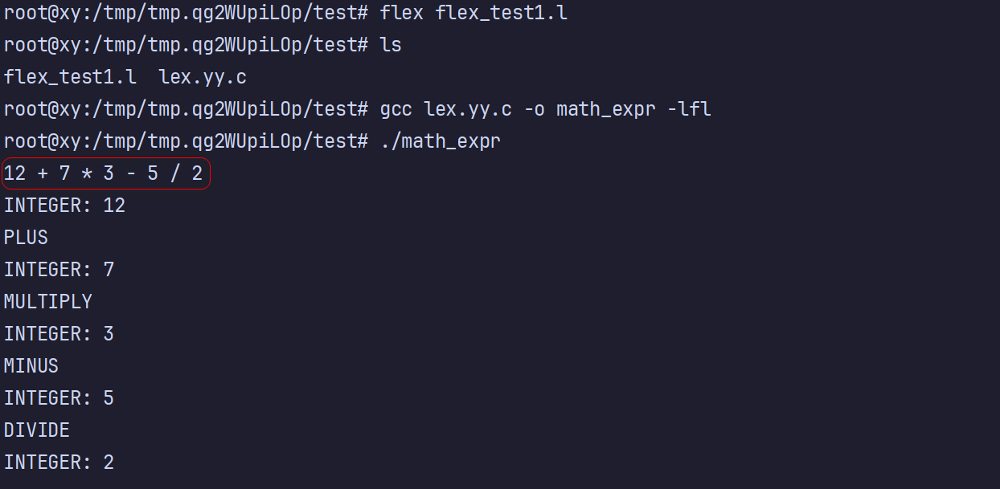
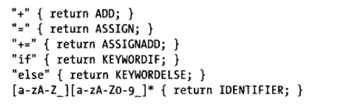
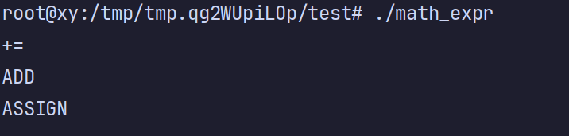
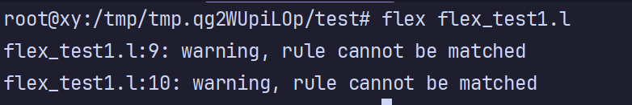
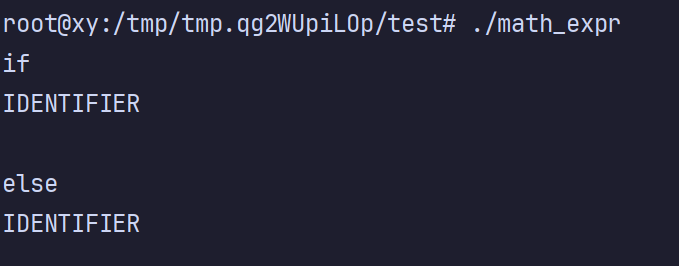
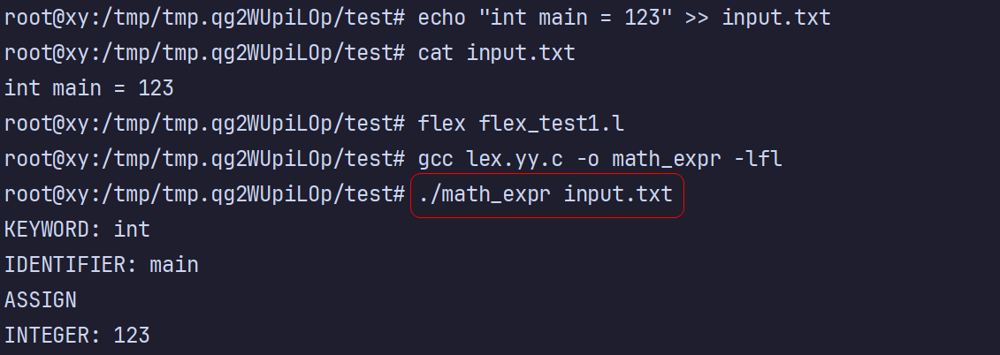
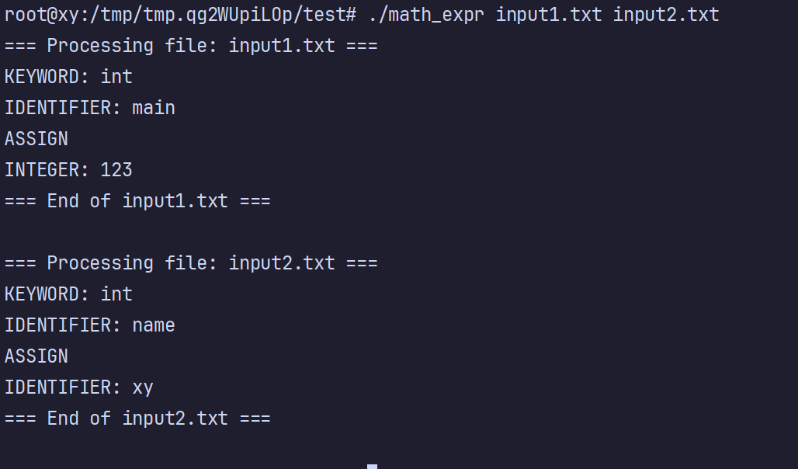
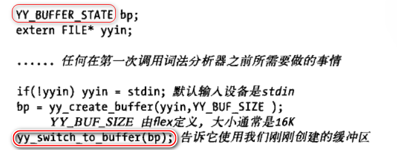
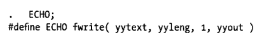
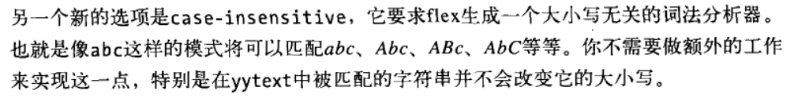

# 使用 flex

## 正则表达式

任何 flex 词法分析器的模式都使用了强大的正则表达式语言。flex 的正则表达式语言本质上是扩展的 POSIX 正则表达式。

```shell
%{
#include <stdio.h>
%}

%option noyywrap

%%
[ \t\r\n]+          ; // 忽略空白

[0-9]+              { printf("INTEGER: %s\n", yytext); }
"+"                 { printf("PLUS\n"); }
"-"                 { printf("MINUS\n"); }
"*"                 { printf("MULTIPLY\n"); }
"/"                 { printf("DIVIDE\n"); }
.                   { printf("INVALID: %s\n", yytext); }
%%
```

运行测试：



接着，解释一下 flex 编写的内容：


## flex 如何处理二义性

大多数 flex 程序都具有二义性，相同的输入可能被多种不同的模式匹配。

flex 通过两个简单的规则来解决它：

1. 词法分析器匹配输入时匹配尽可能多的字符串
2. 如果两个模式都可以匹配的话，匹配在程序中更早出现的模式



把图中的 return 替换成前面用到的 printf，方便输出：


对于前三个模式来说，字符串 += 被匹配为一个记号，因为 += 比 + 更长。

对于后三个模式来说，只要匹配关键字的模式先于匹配标识符的模式，词法分析器就可以正确地匹配关键字。

尝试删除此模式：`"+=" {printf("ASSIGNADD\n");}`  **验证第一条规则**。



尝试移动此模式到 if 和 else 之前：`[a-zA-Z_][a-zA-Z0-9_]* {printf("IDENTIFIER\n");}` **验证第二条规则**。



这个警告是说，如果你把此模式移动到  if 和 else 之前，就永远不会匹配到  if 和 else 设置的模式。因为此模式永远能匹配到 if 和 else 关键字，导致只会输出此模式的匹配，而不会有 if 和 else 的匹配规则匹配成功。

如下图所示，只会输出 IDENTIFIER，而不会输出 KEYWORDIF 或 KEYWORDELSE，因为都不可能匹配到 if 和 else 关键字。



## Flex 词法分析器中的文件 I/O 操作

Flex 使用一个 `FILE*` 类型的**全局变量 yyin 控制输入流**。你可以设置它为任意打开的文件句柄：

```shell
%{
#include <stdio.h>
%}

%option noyywrap

%%
"int"                  { printf("KEYWORD: int\n"); }
[0-9]+                 { printf("INTEGER: %s\n", yytext); }
[a-zA-Z_][a-zA-Z0-9_]* { printf("IDENTIFIER: %s\n", yytext); }
"="                    { printf("ASSIGN\n"); }
";"                    { printf("SEMICOLON\n"); }
[ \t\n]+               ; // 忽略空白
%%

int main(int argc, char **argv) {
    if (argc > 1) {
        yyin = fopen(argv[1], "r");     // 打开文件
        if (!yyin) {
            perror("fopen");
            return 1;
        }
    }

    yylex();  // 开始词法分析
    return 0;
}
```

演示：



## 读取多个文件

前面演示的是打开一个文件，那如何打开多个文件呢？下面直接关注核心代码，词法解析的代码还是保持不变：

```c++
#include <stdio.h>
#include <stdlib.h>

int main(int argc, char **argv) {
    if (argc < 2) {
        fprintf(stderr, "Usage: %s file1 [file2 ...]\n", argv[0]);
        return 1;
    }

    for (int i = 1; i < argc; i++) {		// 遍历多个文件
        FILE *file = fopen(argv[i], "r");
        if (!file) {
            perror(argv[i]);
            continue;
        }

        printf("=== Processing file: %s ===\n", argv[i]);
        yyrestart(file);  // 关键：安全地设置输入并清除缓冲
        yylex();
        fclose(file);
        printf("=== End of %s ===\n\n", argv[i]);
    }

    return 0;
}
```

演示：



## Flex 词法分析器中的 I/O 结构

### Flex 词法分析器的输入

（1）设置 yyin 来读取所需文件（前面演示过）

Flex 默认从标准输入 `stdin` 读取，如果你想从文件读取，需要设置 `yyin`：

```c++
extern FILE *yyin;

int main() {
    yyin = fopen("input.txt", "r");
    if (!yyin) {
        perror("fopen failed");
        return 1;
    }
    yylex();  // 启动词法分析器
    fclose(yyin);
    return 0;
}
```

（2）创建并使用 YY_BUFFER_STATE 输入缓冲区

YY_BUFFER_STATE 结构定义了一个单一的输入源。它包含一个字符串缓冲区以及一些变量和标记。通常它会有一个指向所读取的文件的 FILE*，但是我们也可以创建一个与文件无关的 YY_BUFFER_STATE 来分析已经在内存中的字符串。

```c++
#include <stdio.h>
extern YY_BUFFER_STATE yy_scan_string(const char *str);
extern void yy_delete_buffer(YY_BUFFER_STATE buffer);

int main() {
    const char *text = "123 abc 456";
    YY_BUFFER_STATE buffer = yy_scan_string(text);
    yylex();
    yy_delete_buffer(buffer);
    return 0;
}
```

而书中的代码示意为先打开一个文件，但是我们想要让这个 YY_BUFFER_STATE 指向我们自定义的缓冲区，而不是文件的内容，可以调用 yy_switch_to_buffer 函数切换/指向自定义的缓冲区上，然后去解析它。

从图中代码来看，是选择把用户在终端输入的信息进行解析。



此外，若你需要从文件读取并用缓冲区控制：

```c++
FILE *f = fopen("input.txt", "r");
YY_BUFFER_STATE buffer = yy_create_buffer(f, YY_BUF_SIZE);
yy_switch_to_buffer(buffer);
yylex();
yy_delete_buffer(buffer);
```

- `yy_create_buffer` 会预先从 文件描述符 f 中读取 `YY_BUF_SIZE`（默认 16 KB） 大小的内容到缓冲区里，不是一下子读完整个文件。
- `yy_switch_to_buffer` 则是告诉 Flex 接下来从这个缓冲区读取输入，而不是标准输入。

这种方式在处理大文件时更高效，因为它是**按需加载**。当分析快到缓冲区末尾时，**Flex 自动调用 `yy_input()`** 去**从文件中再读一块新的 16KB 数据**，补充到缓冲区。如此循环，直到遇到文件结尾（EOF）。

（3）重定义 YY_INPUT

目前，重定义 YY_INPUT 主要用在事件驱动系统里，这种系统的输入来自于其他内容，而这些内容无法预先载入字符串缓冲区且无法支持标准输入。

重定义 `YY_INPUT` 可以完全控制 Flex 的输入来源，适用于从网络、压缩流、内存等读取。

默认定义：

```c++
#define YY_INPUT(buf,result,max_size) \
    if ((result = fread(buf, 1, max_size, yyin)) < 0) \
        YY_FATAL_ERROR("input in flex scanner failed");
```

重定义（在 `%{ %}` 中）：

```c++
%{
#define YY_INPUT(buf,result,max_size) \
    { \
        /* 自定义读取逻辑，比如从内存 */ \
        result = my_custom_input(buf, max_size); \
    }
%}

char *src = "test 123";  // 输入数据
int pos = 0;

int my_custom_input(char *buf, int max_size) {
    int i = 0;
    while (i < max_size && src[pos]) {
        buf[i++] = src[pos++];
    }
    return i;
}
```

### Flex 词法分析器的输出

除非另行设定，否则 flex 总会执行一条默认的规则：所有没有被匹配到的输入都拷贝到 yyout。



flex 运行你在词法分析器顶端设置 `%option nodefault`，使它不要添加默认的规则，这当输入无法被规则完全匹配的时候，会报告一个错误，建议在顶端设置。

## 起始状态

起始状态允许我们指定在特定时刻哪些模式可以被用来匹配。在靠近文件顶端的 %x 行把 IFILE 定义为起始状态，它将在我们寻找 #include 语句中的文件名时被使用。

**在任何时候，这个词法分析器都处在一个起始状态中**，并且**只匹配这个状态所激活的那些模式**。实际上，起始状态定义了一个不同的词法分析器，拥有它自己的规则。

在 Flex 中，**状态（state）** 类似于“模式”或“上下文”，可以让词法分析器根据不同的上下文采用不同的规则。

可以定义和使用多个状态（状态可以定义很多个，一个状态可以对应很多不同的规则），**起始状态就是程序执行时第一个用到的状态**。

因为在编写词法分析器时，**不同上下文可能需要不同规则**。比如：

- 正常代码状态下处理变量、数字等
- 字符串状态下：处理引号内的内容
- 注释状态下：跳过多行注释内容

&nbsp;

（1）定义状态（在 `%{}` 或顶部）

```c++
%x STATE_NAME   
%s STATE_NAME   
```

`%x`：exclusive（排他）状态（只有在这个状态下的规则才生效）

`%s`：inclusive 状态（在这个状态下，默认规则也能生效）

`STATE_NAME`：状态的名称

&nbsp;

exclusive状态的意思是 不会继承默认规则（INITIAL 状态下的规则）。

比如下面这个例子，当进入 `STRING` 状态后，`[a-z]+` 将**不再匹配**，即使输入中出现了小写字母。

那么 inclusive 状态 就不难理解了。

```c++
%x STRING

%%
\"          { BEGIN(STRING); }          // 进入 STRING 状态
<STRING>\"  { BEGIN(INITIAL); }         // 退出 STRING 状态
<STRING>.   { printf("char in string: %s\n", yytext); }

[a-z]+      { printf("word: %s\n", yytext); } // 只在 INITIAL 有效
```

你可以把 `%x` 看作“锁住房门，只有拿了钥匙（写明 `<STATE>`）的人才能进”；而 `%s` 是“开了门，旧的人（默认规则）也能进”。

（2）进入状态（在动作中切换）

```c++
"/*"    { BEGIN(COMMENT); } // 遇到 /* 就进入 COMMENT 状态
```

`BEGIN(状态名)`： 用于切换当前状态

（3）使用状态限定规则

```c++
<COMMENT>"*/"   { BEGIN(INITIAL); } // 注释结束，返回默认状态
<COMMENT>.|\n   ;                   // 注释中其他内容忽略
```

`<状态名>`：表示该规则只在这个状态下有效

（4）设置起始状态

Flex 在程序启动时，默认使用 `INITIAL` 状态。

你也可以在 `main()` 里手动设置起始状态：

```c++
BEGIN(COMMENT); // 直接开始于 COMMENT 状态（不常见）
```

&nbsp;

示例：处理多行注释

```c++
%{
#include <stdio.h>
%}

%x COMMENT	// 定义一个排他状态，只有在这个状态下的规则才生效

%%

"/*"            { BEGIN(COMMENT); }	
<COMMENT>"*/"   { BEGIN(INITIAL); }
<COMMENT>.|\n   ; // 忽略注释内容
.|\n            { printf("CHAR: %s\n", yytext); }	// 非注释内容会打印出来

%%

int main() {
    yylex();
    return 0;
}

```

匹配到 /* 就进入 COMMENT 状态：

- 等待匹配 */ ，匹配成功后进入默认状态 INITIAL
- 否则，忽略注释里面的内容

## 符号表

### 使用符号表

符号表是一个用于**存储标识符及其相关属性**（如类型、作用域、地址等）的数据结构。

常见用途：

- 编译器中记录变量名、函数名
- 语义检查（如变量是否已声明）
- 中间代码生成

```c
typedef struct Symbol {
    char name[64];
    char type[16]; // 如 int, float, etc.
    int line_no;
    struct Symbol *next;
} Symbol;

#define TABLE_SIZE 211
Symbol *symbol_table[TABLE_SIZE];

unsigned int hash(char *name) {
    unsigned int hash = 0;
    while (*name)
        hash = (hash << 2) + *name++;
    return hash % TABLE_SIZE;
}

void insert_symbol(const char *name, const char *type, int line_no) {
    unsigned int index = hash((char *)name);
    Symbol *new_symbol = malloc(sizeof(Symbol));
    strcpy(new_symbol->name, name);
    strcpy(new_symbol->type, type);
    new_symbol->line_no = line_no;
    new_symbol->next = symbol_table[index];
    symbol_table[index] = new_symbol;
}

Symbol* lookup_symbol(const char *name) {
    unsigned int index = hash((char *)name);
    Symbol *entry = symbol_table[index];
    while (entry) {
        if (strcmp(entry->name, name) == 0)
            return entry;
        entry = entry->next;
    }
    return NULL;
}
```

这个符号表通过**哈希表 + 链表法（拉链法）**来实现冲突处理，用于**插入和查找标识符（变量名等）**。

这段代码属于**编译器词法/语法分析阶段**常见组件，作用包括：

- 检查变量是否重复声明；
- 获取变量类型用于语义分析；
- 跟踪变量定义的位置（行号）。

&nbsp;

```c++
insert_symbol("x", "int", 3);
insert_symbol("y", "float", 5);
```

定义了两个变量：

- `"x"` 是 `int` 类型，出现在第 3 行
- `"y"` 是 `float` 类型，出现在第 5 行

它们被插入到 `symbol_table` 哈希表中某个位置，如果名字哈希值冲突，就在链表中管理。

### 额外知识点

在 Flex 中，`%option` 用于设置扫描器的行为。

`%option yylineno` —— 用于启用行号追踪

```c++
%option yylineno

%%
[ \t]+         ;              // 忽略空格、制表符
\n             ;              // 行号自动更新
[a-zA-Z_][a-zA-Z0-9_]*   {
    printf("Found identifier '%s' at line %d\n", yytext, yylineno);
}
%%
```

无需手动维护 `yylineno`，只需确保换行符是被读取的（不能完全跳过换行）。

&nbsp;

`%option case-insensitive` —— 用于忽略大小写匹配（即使正则写的是小写，也能匹配大写）



# 使用 bison

flex 把输入流分解为若干个片段（记号），而 bison 则分析这些记号并基于逻辑进行组合。


# 分析 sql


# flex 规范参考


# bison 规范参考


# 二义性冲突


# 错误报告和恢复


# flex 和bison 进阶


