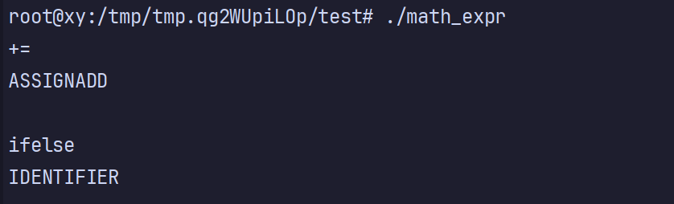

# 使用 flex

## 正则表达式

任何 flex 词法分析器的模式都使用了强大的正则表达式语言。flex 的正则表达式语言本质上是扩展的 POSIX 正则表达式。

```shell
%{
#include <stdio.h>
%}

%option noyywrap

%%
[ \t\r\n]+          ; // 忽略空白

[0-9]+              { printf("INTEGER: %s\n", yytext); }
"+"                 { printf("PLUS\n"); }
"-"                 { printf("MINUS\n"); }
"*"                 { printf("MULTIPLY\n"); }
"/"                 { printf("DIVIDE\n"); }
.                   { printf("INVALID: %s\n", yytext); }
%%
```

运行测试：


接着，解释一下 flex 编写的内容：


## flex 如何处理二义性

大多数 flex 程序都具有二义性，相同的输入可能被多种不同的模式匹配。

flex 通过两个简单的规则来解决它：

1. 词法分析器匹配输入时匹配尽可能多的字符串
2. 如果两个模式都可以匹配的话，匹配在程序中更早出现的模式


把图中的 return 替换成前面用到的 printf，方便输出：



对于前三个模式来说，字符串 += 被匹配为一个记号，因为 += 比 + 更长。

对于后三个模式来说，只要匹配关键字的模式先于匹配标识符的模式，词法分析器就可以正确地匹配关键字。

尝试删除此模式：`"+=" {printf("ASSIGNADD\n");}`  **验证第一条规则**。


尝试移动此模式到 if 和 else 之前：`[a-zA-Z_][a-zA-Z0-9_]* {printf("IDENTIFIER\n");}` **验证第二条规则**。


这个警告是说，如果你把此模式移动到  if 和 else 之前，就永远不会匹配到  if 和 else 设置的模式。因为此模式永远能匹配到 if 和 else 关键字，导致只会输出此模式的匹配，而不会有 if 和 else 的匹配规则匹配成功。

如下图所示，只会输出 IDENTIFIER，而不会输出 KEYWORDIF 或 KEYWORDELSE，因为都不可能匹配到 if 和 else 关键字。


## Flex 词法分析器中的文件 I/O 操作

Flex 使用一个 `FILE*` 类型的**全局变量 yyin 控制输入流**。你可以设置它为任意打开的文件句柄：

```shell
%{
#include <stdio.h>
%}

%option noyywrap

%%
"int"                  { printf("KEYWORD: int\n"); }
[0-9]+                 { printf("INTEGER: %s\n", yytext); }
[a-zA-Z_][a-zA-Z0-9_]* { printf("IDENTIFIER: %s\n", yytext); }
"="                    { printf("ASSIGN\n"); }
";"                    { printf("SEMICOLON\n"); }
[ \t\n]+               ; // 忽略空白
%%

int main(int argc, char **argv) {
    if (argc > 1) {
        yyin = fopen(argv[1], "r");     // 打开文件
        if (!yyin) {
            perror("fopen");
            return 1;
        }
    }

    yylex();  // 开始词法分析
    return 0;
}
```

演示：


## 读取多个文件

前面演示的是打开一个文件，那如何打开多个文件呢？下面直接关注核心代码，词法解析的代码还是保持不变：

```c++
#include <stdio.h>
#include <stdlib.h>

int main(int argc, char **argv) {
    if (argc < 2) {
        fprintf(stderr, "Usage: %s file1 [file2 ...]\n", argv[0]);
        return 1;
    }

    for (int i = 1; i < argc; i++) {		// 遍历多个文件
        FILE *file = fopen(argv[i], "r");
        if (!file) {
            perror(argv[i]);
            continue;
        }

        printf("=== Processing file: %s ===\n", argv[i]);
        yyrestart(file);  // 关键：安全地设置输入并清除缓冲
        yylex();
        fclose(file);
        printf("=== End of %s ===\n\n", argv[i]);
    }

    return 0;
}
```

演示：


## Flex 词法分析器中的 I/O 结构

### Flex 词法分析器的输入


### Flex 词法分析器的输出


# 使用 bison


# 分析 sql


# flex 规范参考


# bison 规范参考


# 二义性冲突


# 错误报告和恢复


# flex 和bison 进阶


